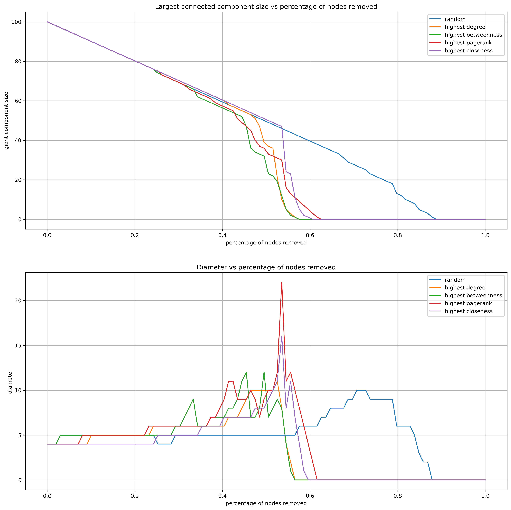
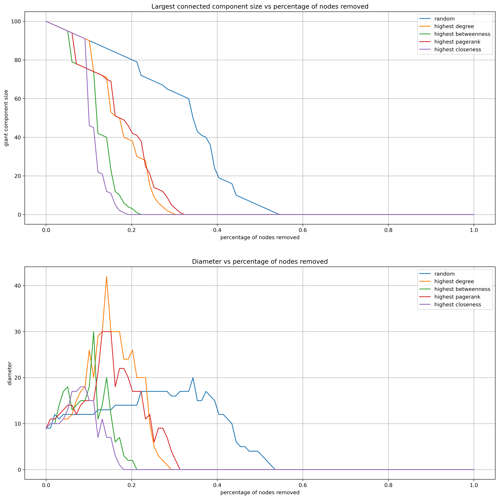
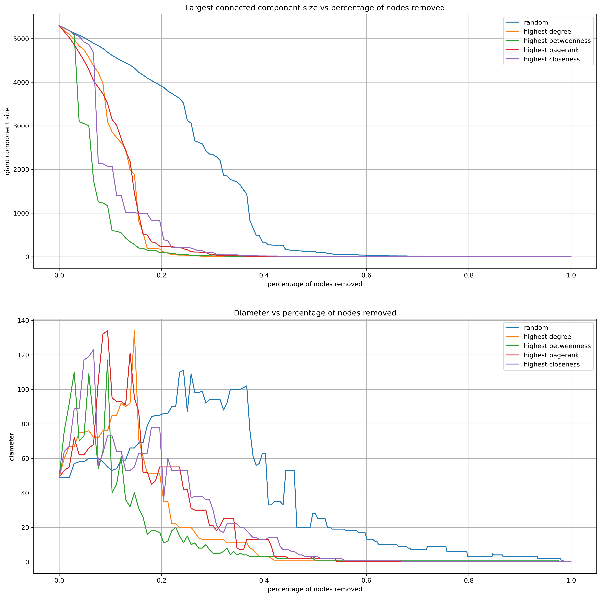
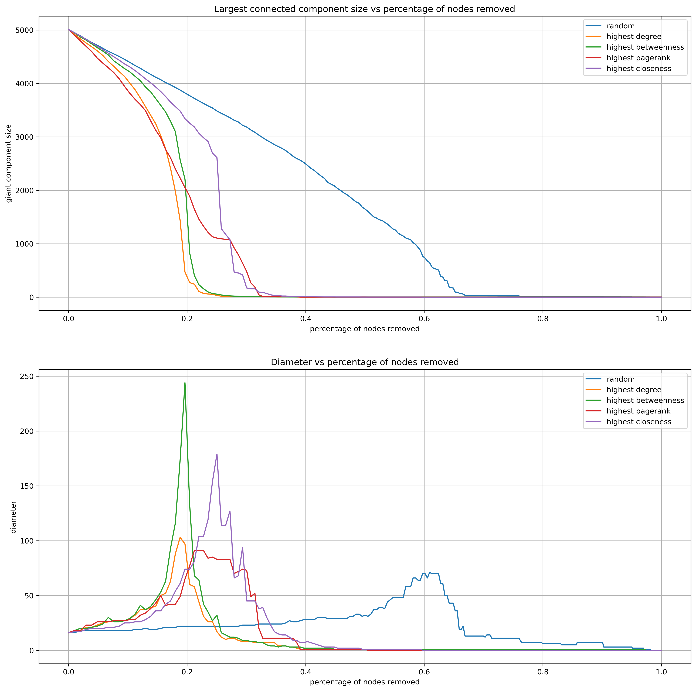

# Network Analysis

## Third Assignment - Network robustness

In this third and final assignment we will test robustness of networks using different kind of attacks.

First, to check the correctness of our code, we will test robustness on small graphs, then we will test our real network.

 

We will use different kind of attacks:

- **random attacks** - nodes will be removed at random
- targeted attacks:
  - **highest degree** - nodes with highest degree will be removed
  - **highest betweenness** - nodes with highest betweenness will be removed
  - **highest closeness** - nodes with highest closeness will be removed
  - **highest pagerank** - nodes with highest pagerank will be removed

> During all the attacks we will consider the largest connected component of the graph.

 

Our analysis will be based on the following metrics:

- **size of the largest connected component** - we expect this metric to decrease during the attacks
- **diameter** - we expect this metric to increase (before dipping) during the attacks

### 1. Testing on Small graphs

In this first part of the assignment we will test the robustness of the network on small graphs. We will use the following graphs:

- Erdos-Renyi graph
- Watts-Strogatz graph

## 1.1. Erdos-Renyi graph

The Erdos-Renyi graph is a mathematical model for generating random graphs.
The graph is constructed by randomly assigning edges between a fixed number of nodes and it's based on two parameters: the total number of nodes in the graph, denoted as "n" and the probability of any pair of nodes being connected by an edge, denoted as "p".   
  
<strong>n</strong>:100 |
<strong>p</strong>:0.1

  
These graphs show the change of size and diameter during an attack of the network.  
The x-axis represents the number of nodes removed from the network, the y-axis represents the size of the largest connected component and the diameter.

As we can see, the size of the largest connected component decreases during the attack, while the diameter for a while increases then decreases.

Another important thing to notice is that Erdos-Renyi graph is very robust as a matter of fact to destroy compleately the graph we have to remove roughly 60% of the nodes.

The 5 attacks can be diverged in two categories: 
- Fast attack: Closeness, Betweenness,Degree and PageRank
- Slow attack: Random

The fast attacks have a similar behavior, in fact the experiment finish after removing 60% of the nodes. The slow attack instead finish after removing 80% of the nodes.
Even if the fast attacks have a similar behavior , the Betwenness Attack has a better performance than the others because if a node has a higher betweenness, it means that it plays a critical role as a bridge or link between different parts of the graph. Removing a node with higher betweenness could have a bigger impact on the connectivity of the graph, as it could break many shorter paths.

## 1.2. Watts-Strogatz graph

The Watts–Strogatz model is a random graph generation model that produces graphs with small-world properties, including short average path lengths and high clustering.
It's defined by three parameters: `n`, `k` and `p`. `n` is the number of nodes, `k` is the number of nearest neighbors and `p` is the probability of rewiring each edge.  

<strong>n</strong>:100 |
<strong>p</strong>:0.1 |
<strong>k</strong>:5

As concerns for the Watts-Strogatz graph, is less robust than the Erdos-Renyi graph. In fact, to destroy compleately the graph we have to in the worst case remove roughly 50% of the nodes and in the best case 20%.

On the other hand the behavior of the size of the largest connected component and the diameter is similar to the Erdos-Renyi graph.
In this case the fast and slow attacks are the same of the previous graph but the fastest attack is the Closeness attack instead of the Betweenness attack.  
Since links are selected randomly, nodes with greater closeness are likely to have more links, which increases the likelihood that one of these links will be removed. Thus, nodes with greater closeness tend to be more affected by link removal than those with greater betweenness.

## 2. Testing on the Real Retwork

**BCSPWR10**, a real-world dataset containing a representation of the entire U.S. electrical power grid network.  
The BCSPWR10 Network has the following specifications:  
**Node**: 5300  
**Edges**: 8271
The result obtained Removing each time 1% of the all nodes is the following:

As we can see the Network is quite Robust infact to destroy it we ha to remove roughly the 60% of the nodes
The fastetìst Attack to destroy the Network in the case of Size of Largest component is the Betweenness Attack while for the Diameter is the Highest Degree Attack because the Diameter is the longest shortest path between two nodes and removing the nodes with the highest degree we are removing the nodes with the most connections so we are increasing the shortest path between two nodes.

## 3. Test on Random Graphs 
In this last test we will test the robustness of the network on random graphs. We generate a random graph with 5300 nodes and 8271 edges, the same number of nodes and edges of the rbecause the Diameter is the longest shortest path between two nodes and removing the nodes with the highest degree we are removing the nodes with the most connections so we are increasing the shortest path between two nodes.eal network.  
The result obtained Removing each time 1% of the all nodes is the following:

As we expected the Random Graph is more robust than the Real Network even if the Real Network follow a behaviour similar to the Random Graph but the result obtained for what concerns the Size of the Largest Component is quite similar to the result obtained for the Real Network.
In this case the fastest Attack for the Size of the Largest Component is the Closeness Attack while for the Diameter is the Betweenness Attack.