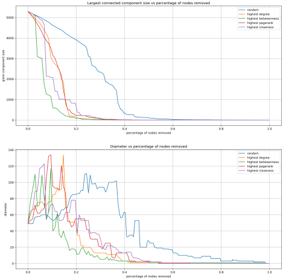

# Network Analysis

## Third Assignment - Network robustness

In this third and final assignment we will test robustness of networks using different kind of attacks.

First, to check the correctness of our code, we will test robustness on small graphs, then we will test our real network.

 

We will use different kind of attacks:

- **random attacks** - nodes will be removed at random
- targeted attacks:
  - **highest degree** - nodes with highest degree will be removed
  - **highest betweenness** - nodes with highest betweenness will be removed
  - **highest closeness** - nodes with highest closeness will be removed
  - **highest pagerank** - nodes with highest pagerank will be removed

> During all the attacks we will consider the largest connected component of the graph.

 

Our analysis will be based on the following metrics:

- **size of the largest connected component** - we expect this metric to decrease during the attacks
- **diameter** - we expect this metric to increase (before dipping) during the attacks

### 1. testing on small graphs

In this first part of the assignment we will test the robustness of the network on small graphs. We will use the following graphs:

- Erdos-Renyi graph
- Watts-Strogatz graph

## 1.1. Erdos-Renyi graph

The Erdos-Renyi graph is a mathematical model for generating random graphs.
The graph is constructed by randomly assigning edges between a fixed number of nodes and it's based on two parameters: the total number of nodes in the graph, denoted as "n" and the probability of any pair of nodes being connected by an edge, denoted as "p".   
  
<strong>n</strong>:100 |
<strong>p</strong>:0.1

These graphs show the change in size and diameter during an attack on the network. The x-axis represents the percentage of nodes removed from the network while on the y-axis there is the size of the largest connected component and the diameter.

As we can see, the size of the largest connected component decreases during the attack, while the diameter for a while increases then decreases. 

Another important thing to notice is the robustness of the Erdos-Renyi graph.

The 5 attacks can diverge into two categories: 
Fast attack: Closeness, Betweenness, Degree, and PageRank 
Slow attack: Random 
The fast attacks have similar behavior, in fact, the experiment finishes after removing 60% of the nodes. The slow attack instead finishes after removing 80% of the nodes.

## 1.2. Watts-Strogatz graph

The Watts–Strogatz model is a random graph generation model that produces graphs with small-world properties, including short average path lengths and high clustering.
It's defined by three parameters: `n`, `k` and `p`. `n` is the number of nodes, `k` is the number of nearest neighbors and `p` is the probability of rewiring each edge.  

<strong>n</strong>:100 |
<strong>p</strong>:0.1 |
<strong>k</strong>:15

As concerns the Watts-Strogatz graph, is a bit more robust than Erdos Renyi because of the higher clustering value, as a matter of fact ,if some nodes are randomly removed, the Watts-Strogatz network can still maintain connections between nodes through alternative paths, ensuring greater resilience compared to a completely random network like Erdos-Rényi.
If we decrease the number of k, the network will be less robust.

## 2. Testing on the Real Retwork

**BCSPWR10**, a real-world dataset containing a representation of the entire U.S. electrical power grid network.  
The BCSPWR10 Network has the following specifications:  
**Node**: 5300  
**Edges**: 8271

As we can see the behavior of the network is less robust respect the previous model, the fastest attacks have roughly the same behavior cause of the Poisson distribution of the network even if The betweenness attack is a little bit more effective while the network is more robust respect the targeted attack.

## 3. Testing on Random Graphs

In this last test, we will test the robustness of the network on random graphs.

We generate a random graph with 5300 nodes and 8271 edges. The result obtained from Removing each time 1% of all nodes is the following:

As we expected the Random Graph is a little bit more robust than the Real Network even if the Real Network follows a behavior similar to the Random Graph, the result obtained for what concerns the Size of the Largest Component is quite similar to the result obtained for the Real Network, while the Diameter analysis is pretty different the random network has a Diameter that reaches the maximum value of 250 while the Real Network has a Diameter that reaches the maximum value of 135. 

Another interesting behavior is that the random Network has more linear behavior while the Real Network has a lot of peaks.

## 4. Conclusion
In the above part we compare our network with the random one generated with the same number of nodes and edges.

We want to prove the Molloy-Reed Criteria to evaluate the robustness of the network also called Resilience, very important in our network.

we have to find the critical threshold both for the Random and Real graph, which make us understand when the giant component is no more identifiable.

If the threshold of the real graph is > of the threshold of the random graph the real is robust to random attack.

By the previous experiment, we expect to have a threshold of the real graph < of the threshold of the random graph.

The threshold is calculated as follows:

for the property of the Erdos-Renyi graph, the threshold is calculated like the following

since is fC<fCER confirmed empirically that our network is not robust to rand attack

